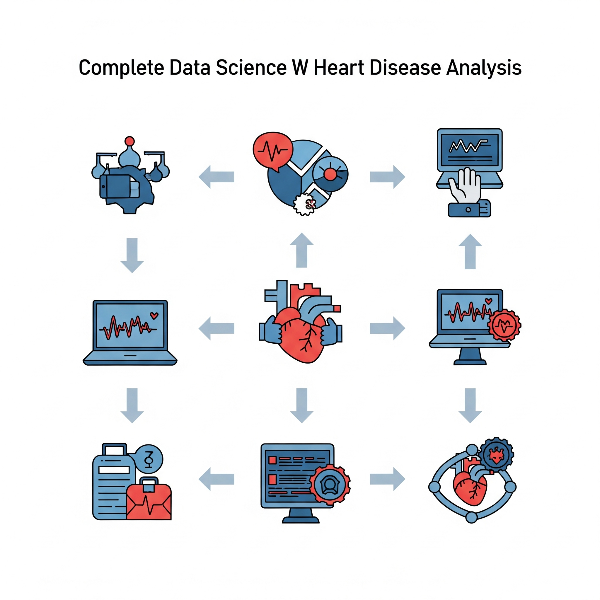
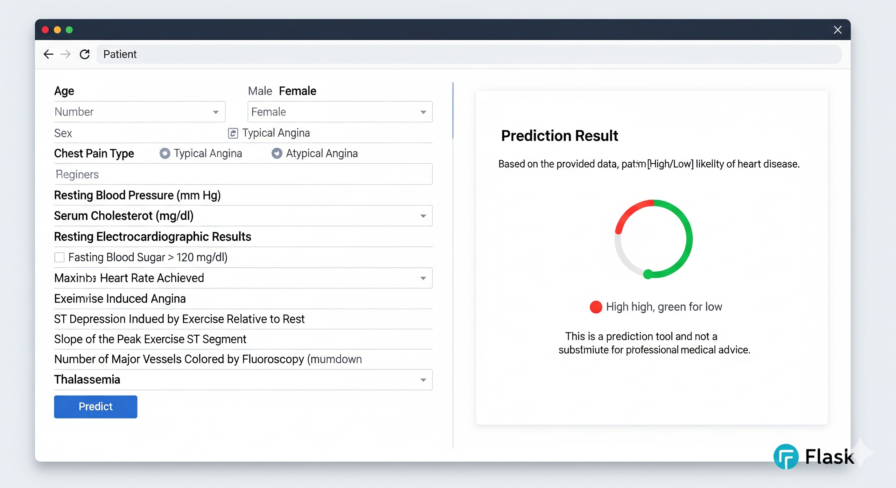

# Heart Disease Prediction System

A machine learning web application that predicts heart disease risk based on patient clinical data using Flask and Scikit-Learn.




## Features

- Machine learning model training with multiple algorithms (Random Forest, Logistic Regression, SVM)
- Web interface for easy input of patient data
- REST API for programmatic access
- Model performance visualization with feature importance charts
- Responsive web design
- Comprehensive data preprocessing pipeline

## Technologies Used

- **Python** - Core programming language
- **Flask** - Web framework
- **Scikit-Learn** - Machine learning library
- **Pandas & NumPy** - Data manipulation
- **Matplotlib & Seaborn** - Data visualization
- **HTML/CSS/JavaScript** - Frontend interface
- **Joblib** - Model serialization

## Installation

1. Clone the repository:
```bash
git clone https://github.com/sumit3162/heart-disease-prediction.git
cd heart-disease-prediction
```

2. Create a virtual environment:
```bash
python -m venv venv
source venv/bin/activate  # On Windows: venv\Scripts\activate
```

3. Install dependencies:
```bash
pip install -r requirements.txt
```

4. Run the Jupyter notebook to train the model:
```bash
jupyter notebook heart_disease_model.ipynb
```
*Execute all cells in the notebook to train and save the model*

5. Start the Flask application:
```bash
python app.py
```

6. Open your browser and navigate to `http://localhost:5000`

## Project Structure

```
heart-disease-prediction/
│
├── app.py
├── heart_disease_model.ipynb
├── templates/
│   ├── index.html
│   └── result.html
├── static/
│   └── style.css
├── models/
│   └── heart_disease_model.pkl
├── requirements.txt
└── heart_dataset.csv
```

## Dataset

The project uses a heart disease dataset with the following features:

- **Demographic**: age, sex
- **Clinical**: trestbps (resting blood pressure), chol (cholesterol), fbs (fasting blood sugar)
- **ECG**: restecg (resting electrocardiographic results)
- **Exercise**: thalch (max heart rate achieved), exang (exercise induced angina), oldpeak (ST depression)
- **Cardiac**: slope (ST segment slope), ca (number of major vessels), thal (thalassemia)
- **Symptoms**: cp (chest pain type)

## Model Training

The system trains and compares three machine learning models:

1. **Random Forest Classifier**
2. **Logistic Regression**
3. **Support Vector Machine (SVM)**

The best performing model is selected and saved for deployment.

## API Usage

You can make predictions via API:

```bash
curl -X POST -H "Content-Type: application/json" -d '{
  "age": 58,
  "trestbps": 130,
  "chol": 220,
  "fbs": 1,
  "restecg": "normal",
  "thalch": 150,
  "exang": false,
  "oldpeak": 1.4,
  "slope": "flat",
  "ca": 0,
  "sex": "Male",
  "cp": "typical angina"
}' http://localhost:5000/api/predict
```

Example response:
```json
{
  "prediction": "normal",
  "probability": 85.24,
  "status": "success"
}
```

## Web Interface

The application provides a user-friendly web form for inputting patient data:

1. **Input Form**: Enter patient clinical parameters
2. **Prediction**: View the prediction result with confidence percentage
3. **New Prediction**: Option to make another prediction

## Model Performance

The system includes visualization of:
- Feature importance analysis
- Confusion matrix
- Classification report
- Model comparison metrics

## Contributing

1. Fork the repository
2. Create a feature branch (`git checkout -b feature/amazing-feature`)
3. Commit your changes (`git commit -m 'Add some amazing feature'`)
4. Push to the branch (`git push origin feature/amazing-feature`)
5. Open a Pull Request

## License

This project is licensed under the MIT License - see the [LICENSE](LICENSE) file for details.

## Acknowledgments

- Dataset sourced from [UCI Machine Learning Repository](https://archive.ics.uci.edu/)
- Icons from [Font Awesome](https://fontawesome.com/)
- CSS styling inspired by modern web design practices

## Contact

 [Shinganesumit80@gmail.com](mailto:Shinganesumit80@gmail.com)

Project Link: [https://github.com/sumit3162/heart-disease-prediction](https://github.com/sumit3162/heart-disease-prediction)

---

**Disclaimer**: This project is for educational purposes only and should not be used for actual medical diagnosis. Always consult healthcare professionals for medical advice.


